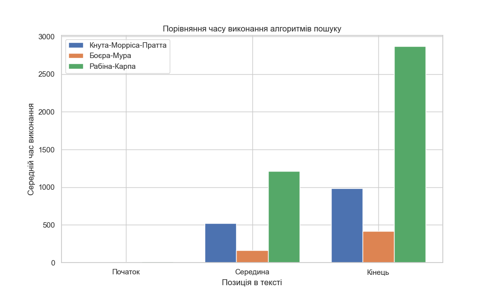
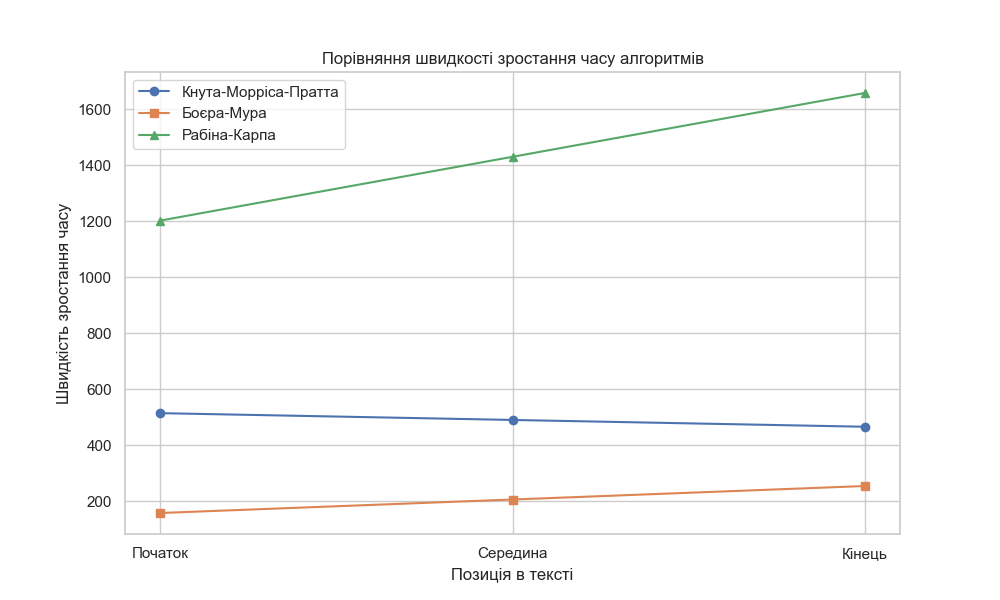

# Порівняльний аналіз алгоритмів пошуку в тексті

## Вступ

У цьому дослідженні було порівняно ефективність трьох алгоритмів пошуку підрядків:
- **Кнута-Морріса-Пратта**
- **Боєра-Мура**
- **Рабіна-Карпа**

Для кожного алгоритму виконувались пошуки зразка в трьох різних позиціях тексту:
- **На початку тексту**
- **У середині тексту**
- **В кінці тексту**

З метою забезпечення достовірності результатів, усі значення є **середніми** для двох різних текстових зразків.

---

## Результати дослідження

### Таблиця середнього часу виконання (мс)

| Алгоритм               | Початок тексту | Середина тексту | Кінець тексту |
|------------------------|----------------|------------------|----------------|
| Кнута-Морріса-Пратта   | 4.49           | 518.67           | 984.28         |
| Боєра-Мура             | 3.33           | 160.87           | 414.74         |
| Рабіна-Карпа           | 10.67          | 1212.62          | 2870.33        |

### Гістограма: Середній час виконання пошуку

> **Висновок:**  
> Найефективнішим алгоритмом за середнім часом виконання виявився **алгоритм Боєра-Мура**.  
> Найповільнішим — **алгоритм Рабіна-Карпа**, особливо при пошуку в кінці тексту.

---

## Аналіз швидкості зростання часу виконання

Для розуміння того, як змінюється ефективність алгоритмів зі збільшенням об'єму тексту, побудовано графік **швидкості зростання часу** в залежності від позиції в тексті.

> **Висновок:**  
> - Алгоритм **Кнута-Морріса-Пратта** демонструє **стабільну швидкість зростання** незалежно від глибини пошуку, що свідчить про його потенційну **вищу ефективність при аналізі великих обсягів тексту**.
> - На відміну від нього, **швидкість зростання часу для алгоритму Боєра-Мура поступово збільшується**, що може знижувати його переваги в умовах великих текстів.
> - Алгоритм **Рабіна-Карпа** демонструє найвищу швидкість зростання часу, що корелює з його найвищими абсолютними значеннями часу виконання.

---

## Висновки

- Найбільш **швидким** в умовах коротких або середніх текстів є **алгоритм Боєра-Мура**.
- Алгоритм **Кнута-Морріса-Пратта** може бути **кращим вибором при пошуку в дуже великих текстах**.
- Алгоритм **Рабіна-Карпа** показав **найгірші результати** за всіма метриками.

---