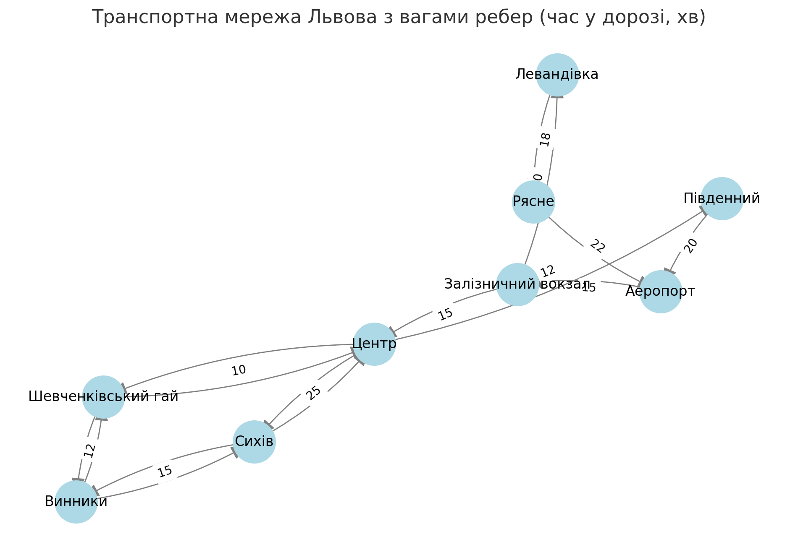

# Завдання: Візуалізація фейкового графу транспортних маршрутів міста Львів

У цьому завданні наша мета полягала у створенні програми, яка будує та візуалізує фейковий граф транспортних маршрутів міста Львова. Для цього ми зчитуємо дані про зупинки (вузли) та з’єднання між ними (ребра), після чого будуємо граф за допомогою бібліотеки NetworkX.

## Ідея завдання

Робота була основана на наступному прототипі графу, який ілюструє транспортні маршрути міста Львова:

На даній схемі кожен вузол символізує зупинку, а ребра — транспортні маршрути, що з'єднують ці зупинки.

## Результат

В результаті виконання коду, ми отримали наступний граф, який демонструє транспортну мережу міста Львова:

### Характеристики графу:
- **Кількість вершин**: 9
- **Кількість ребер**: 14
- **Середня довжина шляху у графі**: 3.0277777777777777

Цей граф був побудований на основі фейкових даних, але ілюструє можливості моделювання транспортних мереж за допомогою бібліотеки NetworkX.