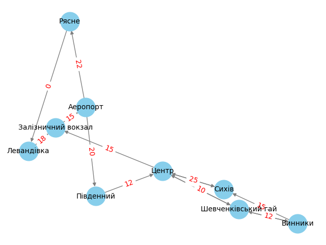

# Аналіз проходження графу алгоритмами DFS і BFS

## Граф

## Початок аналізу
- Точка початку: **"Аеропорт"**

### Шляхи за DFS
Шлях, який проходить алгоритм **DFS** (Depth First Search), виглядає наступним чином:

1. ('Аеропорт', 'Рясне')  
2. ('Рясне', 'Левандівка')  
3. ('Левандівка', 'Залізничний вокзал')  
4. ('Аеропорт', 'Південний')  
5. ('Південний', 'Центр')  
6. ('Центр', 'Сихів')  
7. ('Центр', 'Шевченківський гай')  
8. ('Шевченківський гай', 'Винники')

### Шляхи за BFS
Шлях, який проходить алгоритм **BFS** (Breadth First Search), виглядає наступним чином:

1. ('Аеропорт', 'Рясне')  
2. ('Аеропорт', 'Південний')  
3. ('Рясне', 'Левандівка')  
4. ('Південний', 'Центр')  
5. ('Левандівка', 'Залізничний вокзал')  
6. ('Центр', 'Сихів')  
7. ('Центр', 'Шевченківський гай')  
8. ('Шевченківський гай', 'Винники')

### Різниця у проходженні між алгоритмами DFS і BFS
Основна різниця між шляхами за алгоритмами **DFS** і **BFS** полягає у наступному:  
- **DFS (Depth First Search)** — заходить у кожну вершину від початкової точки і обирає шлях до її нащадків, перш ніж повертатися до інших сусідів.  
- **BFS (Breadth First Search)** — обходить сусідні вершини рівня за рівнем, відвідуючи всі вершини на поточному рівні перш ніж підійматися до нащадків.